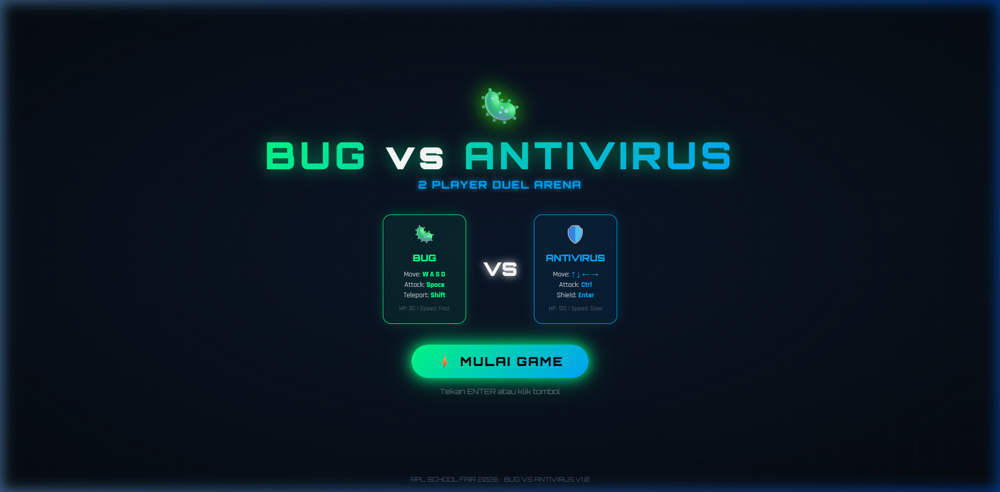
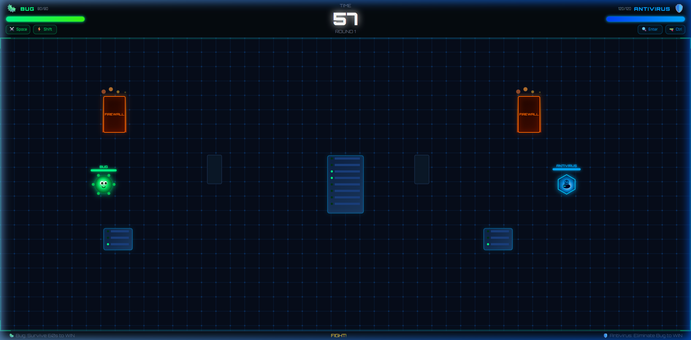
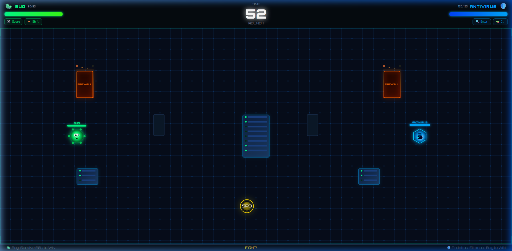

<div align="center">

<br/>


<br/>

> **Game 2 Player Duel Arena berbasis browser** — dimainkan oleh dua pemain pada satu keyboard!  
> Dibuat untuk **Pameran Sekolah Jurusan Rekayasa Perangkat Lunak (RPL)** 🎓

<br/>

</div>

---

## 📸 Screenshots

<div align="center">

### 🏠 Start Screen


### ⚔️ Gameplay Arena


### 💊 Power-up Spawned


</div>

---

## 📖 Tentang Game

**Bug vs Antivirus** adalah game aksi duel 2 pemain yang dimainkan pada satu komputer dengan satu keyboard. Game mengangkat tema **keamanan siber** — Bug (virus) mencoba bertahan hidup dari serangan Antivirus, sementara Antivirus berusaha mengeliminasi Bug sebelum waktu habis.

Game ini dibuat menggunakan:
- **HTML5 Canvas** untuk rendering arena 2D top-down
- **Vanilla JavaScript** untuk game engine (physics, collision, particles, audio)
- **Tailwind CSS** untuk desain UI/HUD yang modern dan responsif
- **Web Audio API** untuk sound effect tanpa file audio eksternal

---

## 🎭 Karakter

### 🦠 Bug (Player 1)
| Atribut | Nilai |
|---|---|
| HP | 80 |
| Kecepatan | Cepat (3.5) |
| Serangan | 3 peluru spread (8 damage/peluru) |
| Skill Khusus | ⚡ **Teleport** — berpindah lokasi secara instan |
| Cooldown Skill | 5 detik |
| Kondisi Menang | Bertahan hidup selama 60 detik |

### 🛡️ Antivirus (Player 2)
| Atribut | Nilai |
|---|---|
| HP | 120 |
| Kecepatan | Lambat (2.2) |
| Serangan | 1 peluru besar (10 damage/peluru) |
| Skill Khusus | 🛡️ **Shield** — kebal serangan selama 4 detik |
| Cooldown Skill | 10 detik |
| Kondisi Menang | Menghabiskan HP Bug |

---

## 🕹️ Kontrol
│ 🦠 BUG│ 🛡️ ANTIVIRUS │
│ Gerak    : W / A / S / D │ Gerak    : ↑ / ↓ / ← / → │
│ Tembak   : Space │  Tembak   : Ctrl (kiri/kanan) │
│ Teleport : Shift │  Shield   : Enter │

---

## 🗺️ Arena

Arena bertema **circuit board / server room** dengan berbagai rintangan:

| Rintangan | Deskripsi |
|---|---|
| 🖥️ Server Rack | Rak server dengan lampu LED berkedip animasi |
| 🔥 Firewall | Tembok api dengan partikel nyala |
| 🧱 Wall | Dinding statis gelap |

> Semua rintangan memblokir pergerakan karakter dan memantulkan (menghancurkan) peluru!

---

## 💊 Power-up

Power-up muncul secara acak setiap **12 detik** (maksimal 3 aktif sekaligus).

| Label | Efek | Durasi |
|---|---|---|
| `HP` ❤️ | Pulihkan 25 HP (Bug) / 35 HP (Antivirus) | Instan |
| `SPD` ⚡ | Kecepatan gerak +60% | 8 detik |
| `ATK` 💥 | Damage +50%, kecepatan peluru +40% | 8 detik |
| `DEF` 🛡️ | Kebal dari semua damage | 3 detik |

---

## ✨ Fitur

- ✅ **2 Player Local Multiplayer** — 1 keyboard, 1 layar
- ✅ **HTML5 Canvas Rendering** — animasi 60fps yang smooth
- ✅ **Sound Effects** via Web Audio API — tanpa file audio eksternal
- ✅ **Particle System** — ledakan, teleport, shield burst
- ✅ **Bullet Trail Effect** — jejak peluru yang keren
- ✅ **Skill Cooldown** dengan indikator timer di HUD
- ✅ **Kill Feed** — notifikasi aksi di tengah layar
- ✅ **Shield Visual** — hexagon barrier berputar berlapis saat skill aktif
- ✅ **HP Bar** berwarna dinamis (hijau → merah saat kritis)
- ✅ **Timer Warning** — angka merah berkedip di 10 detik terakhir
- ✅ **Win Screen** dengan statistik akhir pertandingan
- ✅ **Tailwind CSS** — UI modern, responsif, neon-themed
- ✅ **Zero Dependencies** — tidak butuh `npm install` sama sekali!

---

## 🚀 Cara Menjalankan

### ✅ Cara 1: Buka Langsung (Paling Mudah)

```
Cukup klik dua kali file index.html
```

> ⚠️ Beberapa fitur seperti sound mungkin memerlukan interaksi pengguna terlebih dahulu di browser modern.

---

### ✅ Cara 2: Live Server (VS Code Extension) — Direkomendasikan

1. Install ekstensi **Live Server** di VS Code
2. Klik kanan `index.html` → **"Open with Live Server"**
3. Browser akan otomatis membuka `http://127.0.0.1:5500`

---

### ✅ Cara 3: Python HTTP Server

**Pastikan Python sudah terinstall:**

```bash
python --version
```

**Jalankan server:**

```bash
# Masuk ke folder project
cd bug-vs-antivirus

# Python 3
python -m http.server 8080

# Python 2 (jika Python 3 tidak ada)
python -m SimpleHTTPServer 8080
```

**Buka di browser:**
```
http://localhost:8080
```

---

### ✅ Cara 4: Node.js HTTP Server

```bash
# Install serve secara global (sekali saja)
npm install -g serve

# Jalankan di folder project
cd bug-vs-antivirus
serve .
```

**Buka di browser:**
```
http://localhost:3000
```

---

## 📁 Struktur File

```
bug-vs-antivirus/
│
├── 📄 index.html          # Struktur HTML: Start Screen, HUD, Win Screen
├── 🎨 style.css           # Animasi, tema circuit-board, Tailwind extensions
├── ⚙️  game.js             # Game engine lengkap (~1.300 baris)
├── 📁 screenshots/         # Screenshot untuk dokumentasi
│   ├── start_screen.png
│   ├── start_screen_shield.png
│   ├── gameplay.png
│   └── gameplay_powerup.png
└── 📖 README.md            # Dokumentasi ini
```

### Penjelasan `game.js`

```
game.js
├── CONSTANTS           — Konfigurasi HP, speed, cooldown, damage
├── AUDIO ENGINE        — Web Audio API: tone generator & SFX
├── GAME STATE          — Inisialisasi state pemain, peluru, partikel
├── CANVAS RESIZE       — Responsive canvas handler
├── OBSTACLES           — Posisi & tipe rintangan arena
├── COLLISION           — AABB & circle-rect collision detection
├── MOVEMENT            — Input movement Bug & Antivirus
├── SHOOTING            — Spawn & arah peluru
├── SKILLS
│   ├── handleTeleport()  — Skill Bug: teleport instant
│   └── handleShield()    — Skill AV: perisai 4 detik
├── DAMAGE & HP         — Sistem damage, invincibility frames
├── BULLETS UPDATE      — Physics peluru, trail, collision check
├── PARTICLES           — Sistem partikel ledakan & efek
├── POWER-UPS           — Spawn, pickup, dan aplikasi efek
├── SHIELD EFFECT       — Update & render hexagon shield burst
├── TIMER               — Countdown 60 detik + warning
├── COOLDOWN UPDATES    — Tick cooldown & update HUD cards
├── HUD UPDATE          — Sinkronisasi HP bar DOM
├── KILL FEED           — Notifikasi aksi in-game
├── RENDERING
│   ├── drawArena()       — Circuit grid, neon border, corner
│   ├── drawObstacles()   — Server rack, firewall, wall
│   ├── drawBug()         — Karakter virus hijau animasi
│   ├── drawAV()          — Karakter robot biru + shield visual
│   ├── drawBullets()     — Peluru + trail effect
│   ├── drawParticles()   — Partikel ledakan
│   ├── drawPowerups()    — Power-up pulsing glow
│   ├── drawShieldEffect()— Hexagon burst rings animasi
│   └── drawCharHP()      — Mini HP bar + nama di atas karakter
├── GAME LOOP           — requestAnimationFrame loop
├── END GAME            — Win condition & win screen
└── INPUT HANDLING      — Keyboard event listener
```

---

## 🛠️ Teknologi

| Teknologi | Versi | Kegunaan |
|---|---|---|
| HTML5 | — | Struktur halaman & Canvas API |
| CSS3 | — | Animasi keyframe & custom properties |
| JavaScript | ES2020+ | Game engine, physics, audio |
| Tailwind CSS | v3 (CDN) | UI styling, responsif, utility classes |
| Web Audio API | Browser Native | Sound effects tanpa file eksternal |
| HTML5 Canvas | Browser Native | Rendering 2D arena & karakter |
| Google Fonts | CDN | Font Orbitron & Rajdhani |

---

## 🎨 Desain Visual

| Elemen | Detail |
|---|---|
| Tema Warna | Hijau neon `#00ff88` (Bug) vs Biru neon `#00aaff` (Antivirus) |
| Background | Circuit board grid animasi scrolling |
| Font | Orbitron (display) + Rajdhani (body) |
| Efek | Glow, glassmorphism, gradient, neon border |
| Animasi | Floating, pulse, scanline, particle burst, shield spin |

---

## 🏆 Kondisi Menang & Strategi

### 🦠 Strategi sebagai Bug
- Terus **bergerak** — jangan diam!
- Gunakan **Teleport** saat HP menipis atau terpojok
- Hindari Antivirus dan bertahan hidup hingga **waktu habis**
- Gunakan rintangan sebagai **perisai** dari tembakan

### 🛡️ Strategi sebagai Antivirus
- Pojokkan Bug ke sudut arena
- Gunakan **Shield** saat menerima banyak tembakan, bukan panik
- Tembak **terus-menerus** saat berhadapan langsung
- Blokir jalur lari Bug dengan memanfaatkan kecepatan lebih rendah

---

## ⚙️ Konfigurasi Game

Semua nilai dapat diubah di bagian `CONSTANTS` dalam `game.js`:

```javascript
const GAME_DURATION    = 60;     // Durasi pertandingan (detik)
const BUG_MAX_HP       = 80;     // HP maksimal Bug
const AV_MAX_HP        = 120;    // HP maksimal Antivirus
const BUG_SPEED        = 3.5;    // Kecepatan Bug
const AV_SPEED         = 2.2;    // Kecepatan Antivirus
const BULLET_SPEED     = 7;      // Kecepatan peluru Bug
const AV_BULLET_SPEED  = 5.5;    // Kecepatan peluru Antivirus
const BULLET_DMG_BUG   = 8;      // Damage peluru Bug per hit
const BULLET_DMG_AV    = 10;     // Damage peluru Antivirus per hit
const TELEPORT_CD      = 5000;   // Cooldown Teleport Bug (ms)
const SHIELD_CD        = 10000;  // Cooldown Shield Antivirus (ms)
const SHIELD_DUR       = 4000;   // Durasi Shield aktif (ms)
const POWERUP_INTERVAL = 12000;  // Jarak spawn power-up (ms)
const POWERUP_DURATION = 8000;   // Durasi efek power-up (ms)
```

---

## 🌐 Browser yang Didukung

| Browser | Status |
|---|---|
| Google Chrome 90+ | ✅ Didukung Penuh |
| Mozilla Firefox 88+ | ✅ Didukung Penuh |
| Microsoft Edge 90+ | ✅ Didukung Penuh |
| Safari 14+ | ✅ Didukung Penuh |
| Opera 76+ | ✅ Didukung Penuh |

> 💡 **Tips:** Gunakan Chrome atau Edge untuk performa terbaik.

---

## 📝 Known Issues & Catatan

- Sound effect pertama kali membutuhkan interaksi pengguna (klik/tekan tombol) karena kebijakan autoplay browser modern — ini sudah ditangani karena audio diinisialisasi saat tombol Start ditekan.
- Game didesain untuk layar horizontal (landscape). Pada layar sempit, beberapa elemen HUD bisa terpotong.
- Skill `Shield` tidak dapat distack dengan efek `DEF` power-up (keduanya menggunakan sistem `invincible` yang sama, namun Shield lebih prioritas).

---

## 👨‍💻 Pengembang

<div align="center">

Dibuat oleh Bintang Surya untuk **Pameran Sekolah Jurusan RPL**

</div>

---

## 📄 Lisensi

Project ini dibuat untuk keperluan edukasi dan pameran sekolah.  
Bebas digunakan dan dimodifikasi untuk keperluan pembelajaran.

---

<div align="center">

**⭐ Kalau project ini bermanfaat, jangan lupa kasih star ya! ⭐**

`🦠 Bug vs 🛡️ Antivirus — Who will win?`

</div>
